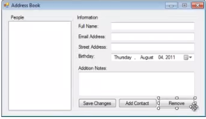

# Разработка простого телефонного справочника

**Цель работы:** научиться использовать коллекции (**List**) и классы

## Телефонный справочник

Необходимо разработать простое приложение типа **Windows Forms**, представляющее телефонную записную книжку.

Возможности приложения:

- ввод исходных данных с помощью полей формы;
- просмотр существующих данных в полях формы;
- удаление выбранной записи;
- сохранение данных в файле;
- загрузка данных из файла.

Данные должны храниться в объекте класса **Person** (см. листинг ниже). В программе необходимо создать коллекцию **List** для хранения серии объектов **Person**.

Навигация по записям осуществляется в левом окне, содержащим имена людей (элемент управления **listView**).


## Внешний вид приложения



## Прототип

В качестве прототипа можно использовать следующий код:

```csharp
using System;
using System.Collections.Generic;
using System.ComponentModel;
using System.Data;
using System.Drawing;
using System.Linq;
using System.Text;
using System.Windows.Forms;
using System.IO;
using System.Web;


namespace AddressBook
{
    public partial class AddressBook : Form
    {
        public AddressBook()
        {
            InitializeComponent();
        }

        List<Person> people = new List<Person>();

        private void AddressBook_Load(object sender, EventArgs e)
        {
            string path = Environment.GetFolderPath(Environment.SpecialFolder.ApplicationData);
            if (!Directory.Exists(path + "\\Address Book - Joe"))
                Directory.CreateDirectory(path + "\\Address Book - Joe");
            if (!File.Exists(path + "\\Address Book - Joe\\settings.xml"))
                File.Create((path + "\\Address Book - Joe\\settings.xml"));
        }

        private void btnAdd_Click(object sender, EventArgs e)
        {
            Person p = new Person();
            p.FirstName = txtFName.Text;
            p.Address = txtAddress.Text;
            p.City = txtCity.Text;
            p.State = comboState.Text;
            p.ZipCode = txtZip.Text;
            p.Email = txtEmail.Text;
            p.PhoneNumber = txtPhone.Text;
            p.Additional = rtxtAdd.Text;
            people.Add(p);
            listView1.Items.Add(p.FirstName);
            txtFName.Text = "";
            txtAddress.Text = "";
            txtCity.Text = "";
            comboState.Text = "";
            txtZip.Text = "";
            txtEmail.Text = "";
            txtPhone.Text = "";
            rtxtAdd.Text = "";
        }

        private void listView1_SelectedIndexChanged(object sender, EventArgs e)
        {
            txtFName.Text = people[listView1.SelectedItems[0].Index].FirstName;
            txtAddress.Text = people[listView1.SelectedItems[0].Index].Address;
            txtCity.Text = people[listView1.SelectedItems[0].Index].City;
            comboState.Text = people[listView1.SelectedItems[0].Index].State;
            txtZip.Text = people[listView1.SelectedItems[0].Index].ZipCode;
            txtEmail.Text = people[listView1.SelectedItems[0].Index].Email;
            txtPhone.Text = people[listView1.SelectedItems[0].Index].PhoneNumber;
            txtZip.Text = people[listView1.SelectedItems[0].Index].ZipCode;
            rtxtAdd.Text = people[listView1.SelectedItems[0].Index].Additional;

        }

        private void txtFName_TextChanged(object sender, EventArgs e)
        {

        }
    }

    public class Person
    {
        public string FirstName { get; set; }
        public string Address { get; set; }
        public string City { get; set; }
        public string State { get; set; }
        public string ZipCode { get; set; }
        public string PhoneNumber { get; set; }
        public string Email { get; set; }
        public string Additional { get; set; }
    }
}
```
## Результаты работы

Результаты работы в виде файлов проекта (кроме исполняемых, находящихся в папке `Debug` или `Release`) прислать в пул-запросе (в папке `App`) для своей ветки. Сделать скриншот главного окна приложения Windows Forms и поместить файл в папку `src`.

## Алгоритм выполнения работы

Для выполнения работы необходимо:

1. Выполнить *fork* репозитария в свой аккаунт.
1. Выполнить клонирование репозитария из своего аккаунта к себе на локальную машину (`git clone`).
1. Создать ветку **git** с индивидуальным номером (`git branch имя_ветки`).
1. Сделать ветку активной (`git checkout имя`).
1. Необходимо разместить исходные файлы с решениями задач, поместив **.h, .cpp, .cs** в подкаталоге **src** репозитория и скриншот главного окна приложения.
1. Добавить файлы в хранилище (`git add`).
1. Выполнить фиксацию изменений (`git commit -m "комментарий"`).
1. Отправить содержимое ветки в свой удаленный репозиторий (`git push origin имя_ветки`).
1. Создать пул-запрос в репозиторий группы и ждать результата 


|  ФИО              | Имя ветки |
|-------------------|-----------|
| Афанасьев А.     | b1 |
| Воронов Д.    | b2 |
| Баландин А.    | b3 |
| Бритова Ю.|  b4 |
| Голованов Д.         | b5  |
| Головин Д.        | b6 |
| Гордеев В.       | b7 |
| Дукова Е.     | b8 |
| Комаров Д.       | b9 |
| Кузминский И.     | b10 |
| Кузьмин А.          | b11 |
| Кулаков Р.  | b12  |
| Майоров Н.     | b13 |
| Матвеев С.        | b14 |
| Мизгирев А.            | b15 |
| Мишанина П. | b16 |
| Новикова В.     | b17 |
| Орлов А.      | b18 |
| Слащева Я. | b19 |
| Сорокин А. | b20 |
